# 4-镜像
Docker	运行容器前需要本地存在对应的镜像,如果镜像不存在本地,Docker	会从
镜像仓库下载(默认是	Docker	Hub	公共注册服务器中的仓库)。

本章将介绍更多关于镜像的内容,包括:

- 从仓库获取镜像;
- 管理本地主机上的镜像;
- 介绍镜像实现的基本原理。

### 获取镜像

可以使用`docker	pull`命令来从仓库获取所需要的镜像。

下面的例子将从`Docker	Hub`仓库下载一个Centos6.7操作系统的镜像。

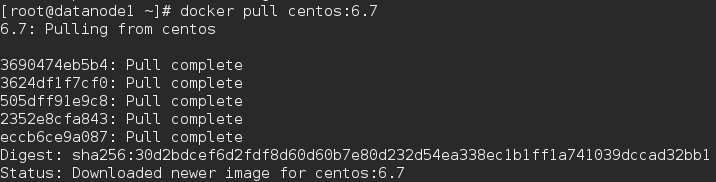

下载过程中,会输出获取镜像的每一层信息。

该命令实际上相当于	 	$	docker	pull
registry.hub.docker.com/centos:6.7	 	命令,即从注册服务器
	registry.hub.docker.com	 	中的	 	centos	 	仓库来下载标记为6.7	的镜像。

完成后,即可随时使用该镜像了,例如创建一个容器,让其中运行	bash	应用。

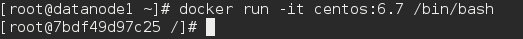

### 列出

使用`docker	images`显示本地已有的镜像。

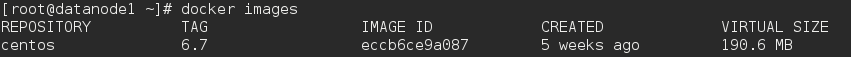

在列出信息中,可以看到几个字段信息来自于哪个仓库,

比如	centos

镜像的标记,比如	6.7

它的ID号(唯一)

创建时间

镜像大小

其中镜像的ID唯一标识了镜像

TAG	 	信息用来标记来自同一个仓库的不同镜像。例如	 	centos	 	仓库中有多个镜像,通过TAG信息来区分发行版本

### 创建

创建镜像有很多方法,用户可以从	Docker	Hub	获取已有镜像并更新,也可以利用
本地文件系统创建一个。

先使用下载的镜像启动容器。

注意:记住容器的	ID(注：不是镜像的ID),稍后还会用到。

在容器中安装gcc：`yum -y install gcc`

当结束后,我们使用	exit	来退出,现在我们的容器已经被我们改变了,使用
	docker	commit	 	命令来提交更新后的副本。

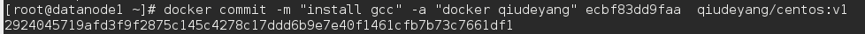

其中, 	-m	 	来指定提交的说明信息,跟我们使用的版本控制工具一样; 	-a	 	可以
指定更新的用户信息;之后是用来创建镜像的容器的	ID;最后指定目标镜像的仓库
名和	tag	信息。创建成功后会返回这个镜像的	ID	信息。

使用	 	docker	images	 	来查看新创建的镜像。

使用新的镜像来启动容器

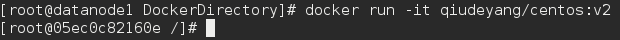

#### 利用	Dockerfile	来创建镜像

使用	 	docker	commit	 	来扩展一个镜像比较简单,但是不方便在一个团队中分
享。我们可以使用	 	docker	build	 	来创建一个新的镜像。为此,首先需要创建一
个	Dockerfile,包含一些如何创建镜像的指令。

新建一个目录和一个	Dockerfile

Dockerfile	中每一条指令都创建镜像的一层,例如:

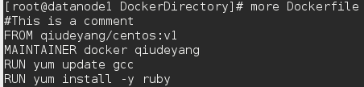

Dockerfile	基本的语法是

- 使用 	#	 来注释
-	FROM	 	指令告诉	Docker	使用哪个镜像作为基础
- 接着是维护者的信息
-	RUN	 开头的指令会在创建中运行,比如安装一个软件包,在这里使用	yum install -y 来安装了一些软件

编写完成	Dockerfile	后可以使用	 	docker	build	 	来生成镜像。

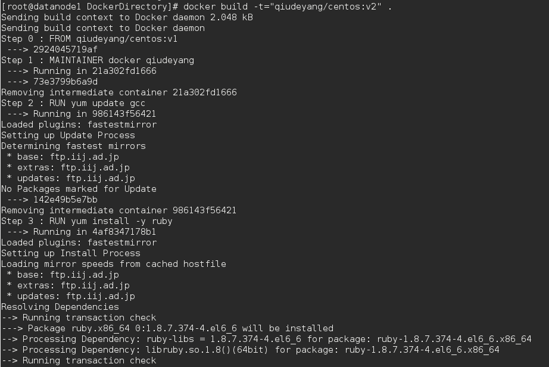

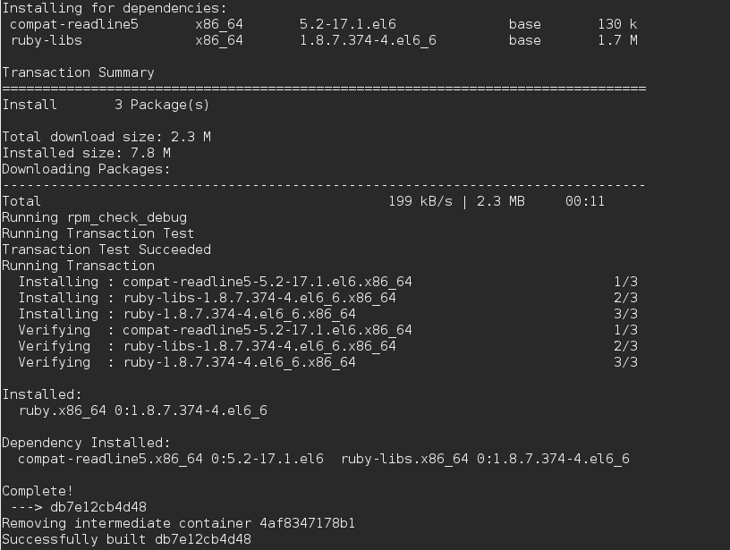

注意：后面的.千万别忘了，指代当前目录

其中	 	-t	 	标记来添加	tag,指定新的镜像的用户信息。	“.”	是	Dockerfile	所在的路
径(当前目录),也可以替换为一个具体的	Dockerfile	的路径。

可以看到	build	进程在执行操作。它要做的第一件事情就是上传这个	Dockerfile	内
容,因为所有的操作都要依据	Dockerfile	来进行。	然后,Dockfile	中的指令被一条
一条的执行。每一步都创建了一个新的容器,在容器中执行指令并提交修改(就跟
之前介绍过的	 	docker	commit	 	一样)。当所有的指令都执行完毕之后,返回了
最终的镜像	id。所有的中间步骤所产生的容器都被删除和清理了。

还可以用	 	docker	tag	 	命令来修改镜像的标签。

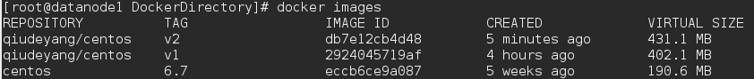

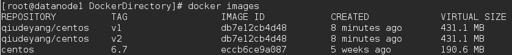

#### 从本地文件系统导入

要从本地文件系统导入一个镜像,可以使用	openvz(容器虚拟化的先锋技术)的
模板来创建:	openvz	的模板下载地址为	[templates](http://openvz.org/Download/template/precreated)	。
比如,先下载了一个	centos-6-x86-minimal.tar.gz	的镜像,之后使用以下命令导入并重新查看新导入的镜像。

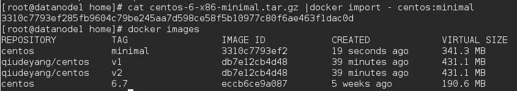

#### 上传镜像

用户可以通过	 	docker	push	 	命令,把自己创建的镜像上传到仓库中来共享。例
如,用户在	Docker	Hub	上完成注册后,可以推送自己的镜像到仓库中。

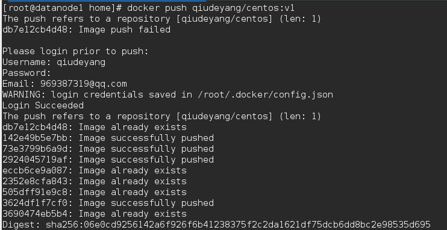

### 存出和载入

#### 存出镜像

如果要导出镜像到本地文件,可以使用	 	docker	save	 	命令。

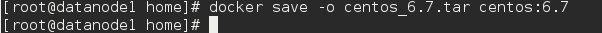

#### 载入镜像

可以使用	 	docker	load	 	从导出的本地文件中再导入到本地镜像库,例如

$	docker	load	--input	centos_6.7.tar

或

$	docker	load	<	centos_6.7.tar

这将导入镜像以及其相关的元数据信息(包括标签等)。

### 移除

如果要移除本地的镜像,可以使用	 	docker	rmi	 	命令。注意	 	docker	rm	 	命令是移除容器。

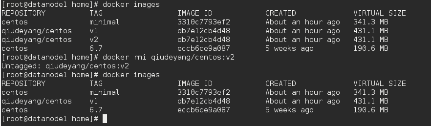

*注意:在删除镜像之前要先用	 	docker	rm	删掉依赖于这个镜像的所有容器。

#### 清理所有未打过标签的本地镜像

docker	images	 	可以列出本地所有的镜像,其中很可能会包含有很多中间状态的
未打过标签的镜像,大量占据着磁盘空间。

使用下面的命令可以清理所有未打过标签的本地镜像

$	docker	rmi	$(docker	images	-q	-f	"dangling=true")

其中	 	-q	 	和	 	-f	 	是缩写,	完整的命令其实可以写成下面这样

$	docker	rmi	$(docker	images	--quiet	--filter	"dangling=true")

### 实现原理

Docker	镜像是怎么实现增量的修改和维护的?	每个镜像都由很多层次构成,
Docker	使用	[Union	FS](https://en.wikipedia.org/wiki/UnionFS)	将这些不同的层结合到一个镜像中去。

通常	Union	FS	有两个用途,	一方面可以实现不借助	LVM、RAID	将多个	disk	挂到
同一个目录下,另一个更常用的就是将一个只读的分支和一个可写的分支联合在一
起,Live	CD	正是基于此方法可以允许在镜像不变的基础上允许用户在其上进行一
些写操作。	Docker	在	AUFS	上构建的容器也是利用了类似的原理。
