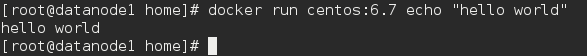
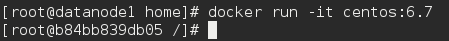
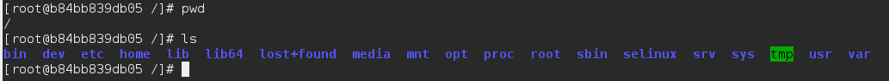
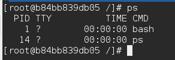
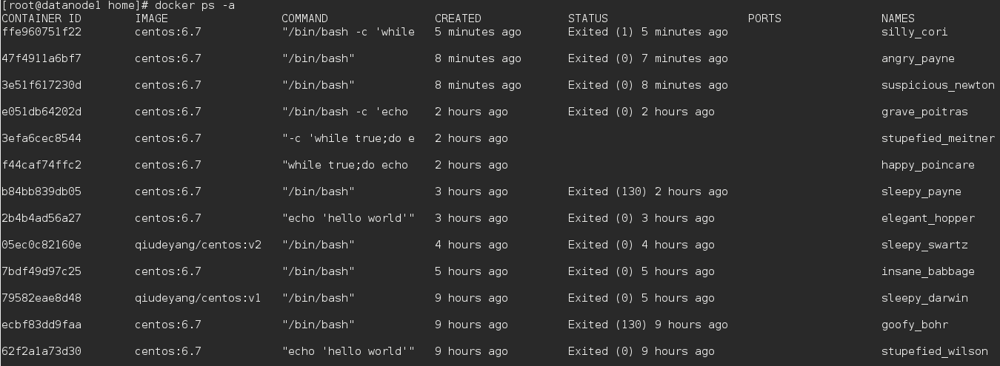
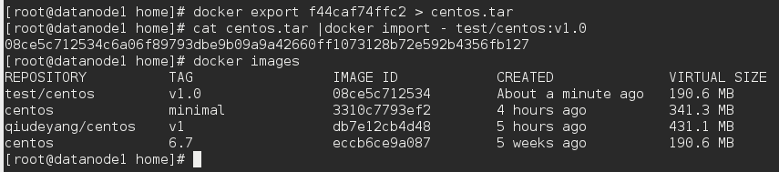
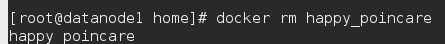

# 5-容器

容器是	Docker	又一核心概念。

简单的说,容器是独立运行的一个或一组应用,以及它们的运行态环境。对应的,
虚拟机可以理解为模拟运行的一整套操作系统(提供了运行态环境和其他系统环
境)和跑在上面的应用。

本章将具体介绍如何来管理一个容器,包括创建、启动和停止等。

### 启动

启动容器有两种方式,一种是基于镜像新建一个容器并启动,另外一个是将在终止
状态(stopped)的容器重新启动。

因为	Docker	的容器实在太轻量级了,很多时候用户都是随时删除和新创建容器。

所需要的命令主要为	 	docker	run	 。
例如,下面的命令输出一个	“Hello	World”,之后终止容器。

这跟在本地直接执行	 	/bin/echo	'hello	world'	 	几乎感觉不出任何区别。

下面的命令则启动一个	bash	终端,允许用户进行交互。

其中, 	-t	 	选项让Docker分配一个伪终端(pseudo-tty)并绑定到容器的标准输入
上,	 	-i	 	则让容器的标准输入保持打开。

在交互模式下,用户可以通过所创建的终端来输入命令,例如

当利用	 	docker	run	 	来创建容器时,Docker	在后台运行的标准操作包括:
- 检查本地是否存在指定的镜像,不存在就从公有仓库下载启动
- 利用镜像创建并启动一个容器
- 分配一个文件系统,并在只读的镜像层外面挂载一层可读写层
- 从宿主主机配置的网桥接口中桥接一个虚拟接口到容器中去
- 从地址池配置一个	ip	地址给容器
- 执行用户指定的应用程序
- 执行完毕后容器被终止

#### 启动已终止容器

可以利用	 	docker	start	 	命令,直接将一个已经终止的容器启动运行。

容器的核心为所执行的应用程序,所需要的资源都是应用程序运行所必需的。除此
之外,并没有其它的资源。可以在伪终端中利用	 	ps	 	或	 	top	 	来查看进程信息。

可见,容器中仅运行了指定的	bash	应用。这种特点使得	Docker	对资源的利用率
极高,是货真价实的轻量级虚拟化。

### 守护态运行

更多的时候,需要让	Docker在后台运行而不是直接把执行命令的结果输出在当前
宿主机下。此时,可以通过添加	 	-d	 	参数来实现。

如果不使用	 	-d	 	参数运行容器。

容器会把输出的结果(STDOUT)打印到宿主机上面

如果使用了	 	-d	 	参数运行容器。

此时容器会在后台运行并不会把输出的结果(STDOUT)打印到宿主机上面(输出结果
可以用docker	logs	查看)。

注:	容器是否会长久运行,是和docker	run指定的命令有关,和	 	-d	 	参数无关。

使用	 	-d	 	参数启动后会返回一个唯一的	id,也可以通过	 	docker	ps	 	命令来查看容器信息。

要获取容器的输出信息,可以通过	 	docker	logs	 	命令。

### 终止

可以使用	 	docker	stop	 	来终止一个运行中的容器。

此外,当Docker容器中指定的应用终结时,容器也自动终止。	例如对于上一章节
中只启动了一个终端的容器,用户通过	 	exit	 	命令或	 	Ctrl+d	 	来退出终端时,
所创建的容器立刻终止。

终止状态的容器可以用	 	docker	ps	-a	 	命令看到

处于终止状态的容器,可以通过	 	docker	start	 	命令来重新启动。

此外, 	docker	restart	 	命令会将一个运行态的容器终止,然后再重新启动它。

### 导出和导入

如果要导出本地某个容器,可以使用	 	docker	export	 	命令。

这样将导出容器快照到本地文件。

可以使用	 	docker	import	 	从容器快照文件中再导入为镜像，此外,也可以通过指定	URL	或者某个目录来导入。

*注:用户既可以使用	 	docker	load	 	来导入镜像存储文件到本地镜像库,也可以
使用	 	docker	import	 	来导入一个容器快照到本地镜像库。这两者的区别在于容
器快照文件将丢弃所有的历史记录和元数据信息(即仅保存容器当时的快照状
态),而镜像存储文件将保存完整记录,体积也要大。此外,从容器快照文件导入
时可以重新指定标签等元数据信息。

### 删除

可以使用	 	docker	rm	 	来删除一个处于终止状态的容器。	例如

用	 	docker	ps	-a	 	命令可以查看所有已经创建的包括终止状态的容器,如果数量
太多要一个个删除可能会很麻烦,用	 	docker	rm	$(docker	ps	-a	-q)	 	可以全
部清理掉。

*注意:这个命令其实会试图删除所有的包括还在运行中的容器,不过就像上面提过
的	 	docker	rm	 	默认并不会删除运行中的容器。
