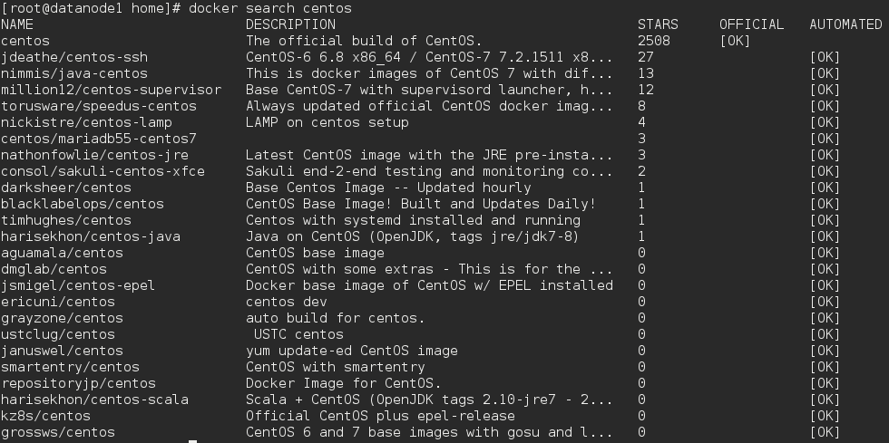
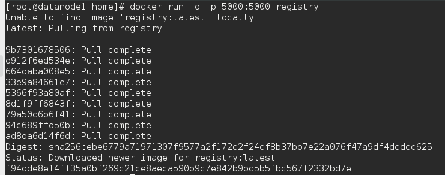

# 6-仓库

仓库(Repository)是集中存放镜像的地方。

一个容易混淆的概念是注册服务器(Registry)。实际上注册服务器是管理仓库的
具体服务器,每个服务器上可以有多个仓库,而每个仓库下面有多个镜像。从这方
面来说,仓库可以被认为是一个具体的项目或目录。例如对于仓库地址
	dl.dockerpool.com/ubuntu	 	来说, 	dl.dockerpool.com	 	是注册服务器地
址, 	ubuntu	 	是仓库名。

大部分时候,并不需要严格区分这两者的概念。

### Docker Hub

用户无需登录即可通过	 	docker	search	 	命令来查找官方仓库中的镜像,并利用
	docker	pull	 	命令来将它下载到本地。

例如以	centos	为关键词进行搜索:

可以看到返回了很多包含关键字的镜像,其中包括镜像名字、描述、星级(表示该
镜像的受欢迎程度)、是否官方创建、是否自动创建。	官方的镜像说明是官方项目
组创建和维护的,automated	资源允许用户验证镜像的来源和内容。

根据是否是官方提供,可将镜像资源分为两类。	一种是类似	centos	这样的基础镜
像,被称为基础或根镜像。这些基础镜像是由	Docker	公司创建、验证、支持、提
供。这样的镜像往往使用单个单词作为名字。	还有一种类型,比如
	tianon/centos	 	镜像,它是由	Docker	的用户创建并维护的,往往带有用户名称
前缀。可以通过前缀	 	user_name/	 	来指定使用某个用户提供的镜像,比如	tianon
用户。

另外,在查找的时候通过	 	-s	N	 	参数可以指定仅显示评价为	 	N	 	星以上的镜像。

#### 自动创建

自动创建(Automated	Builds)功能对于需要经常升级镜像内程序来说,十分方
便。	有时候,用户创建了镜像,安装了某个软件,如果软件发布新版本则需要手动
更新镜像。。

而自动创建允许用户通过	Docker	Hub	指定跟踪一个目标网站(目前支持	[GitHub](https://github.org)
或	[BitBucket](https://bitbucket.org/))上的项目,一旦项目发生新的提交,则自动执行创建。

要配置自动创建,包括如下的步骤:

- 创建并登录	Docker	Hub,以及目标网站;
- 在目标网站中连接帐户到	Docker	Hub;
- 在	Docker	Hub	中	[配置一个自动创建](https://hub.docker.com/);
- 选取一个目标网站中的项目(需要含	Dockerfile)和分支;
- 指定	Dockerfile	的位置,并提交创建。

之后,可以	在Docker	Hub	的	[自动创建页面](https://hub.docker.com/)	中跟踪每次创建的状态

### 私有仓库

有时候使用	Docker	Hub	这样的公共仓库可能不方便,用户可以创建一个本地仓库
供私人使用。

有时候使用	Docker	Hub	这样的公共仓库可能不方便,用户可以创建一个本地仓库
供私人使用。

在安装了	Docker	后,可以通过获取官方	registry	镜像来运行。

